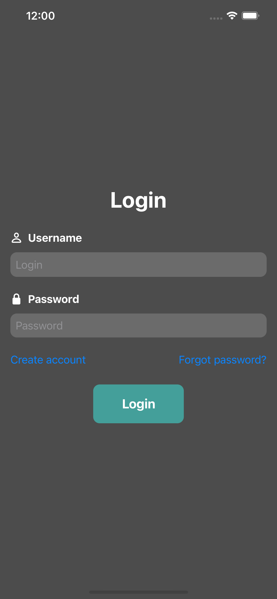
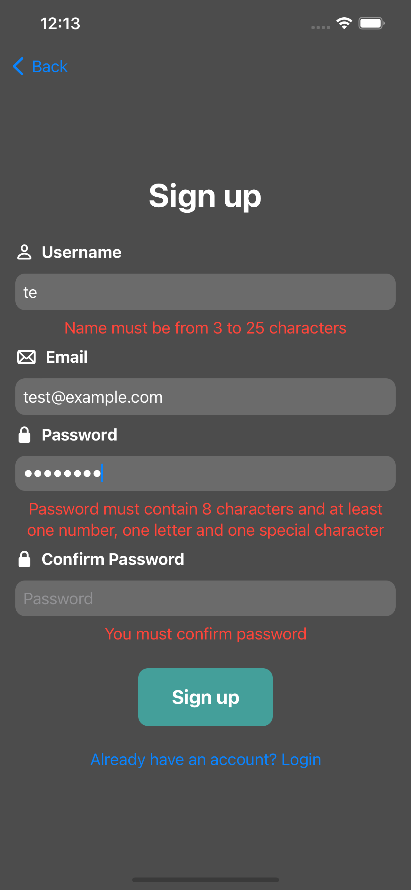
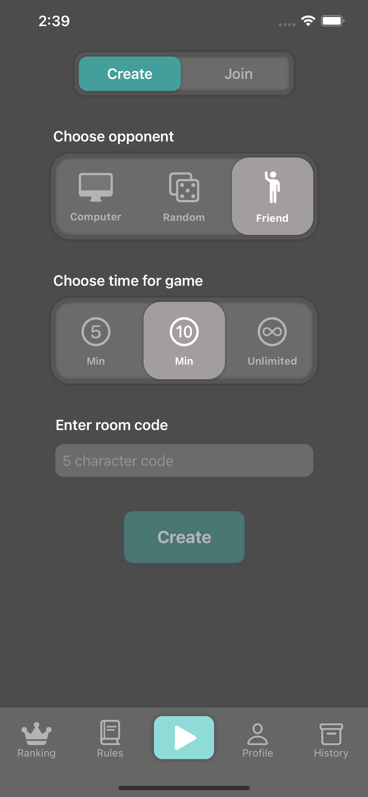
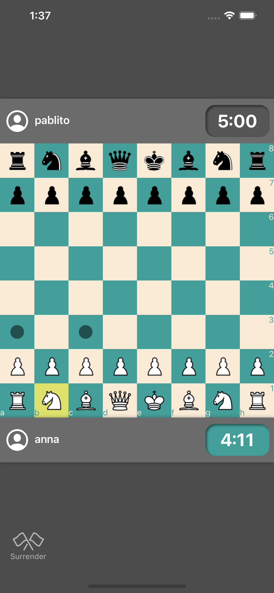
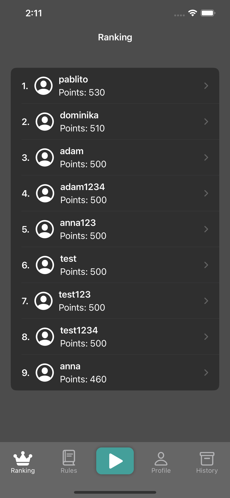
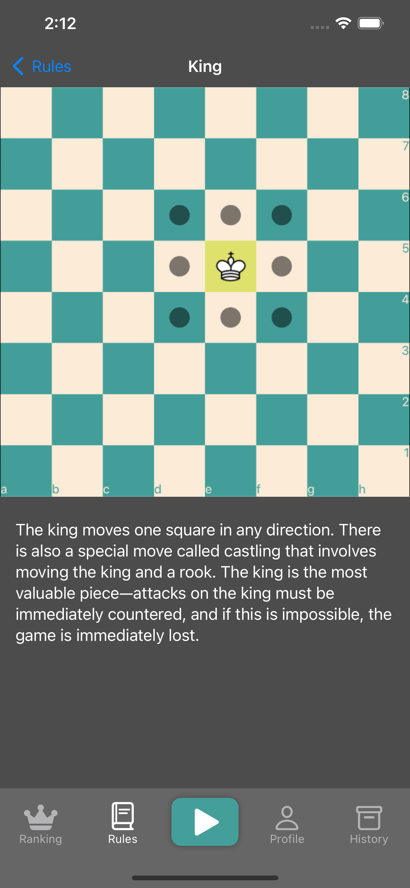
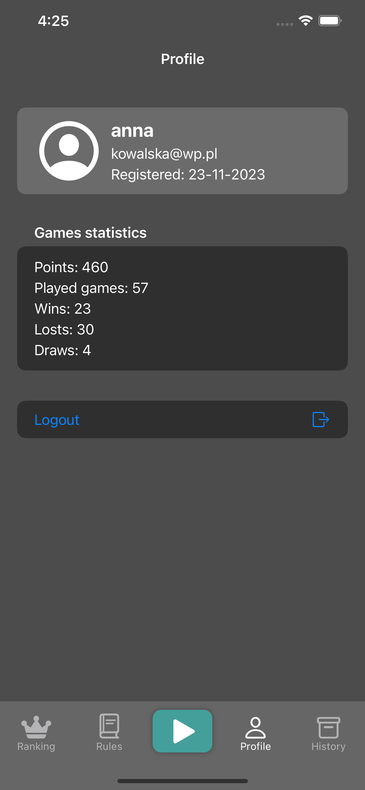
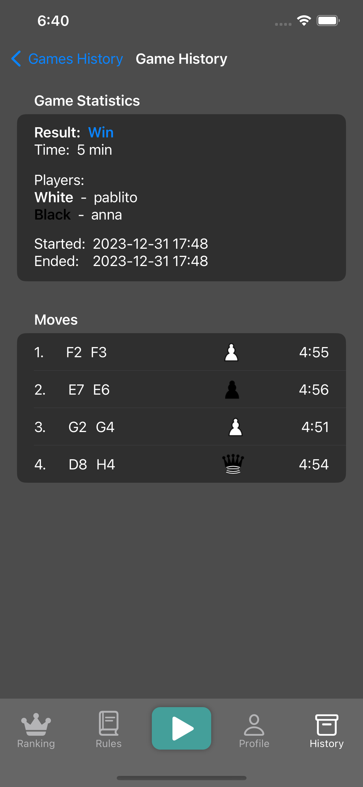

# ChessClientMobile
Presentation of mobile chess application built using SwiftUI and SocketIO.

### Login and registration view
 

### Game configuration and game view
 

### User ranking and rule view
 

### User profile and game history view
 